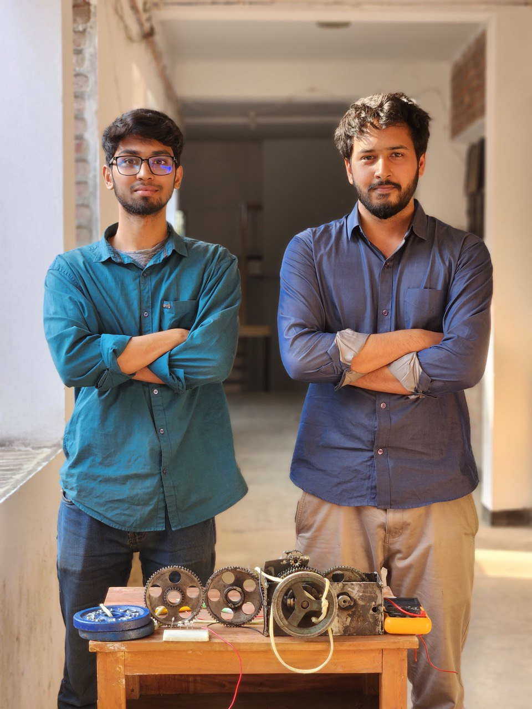
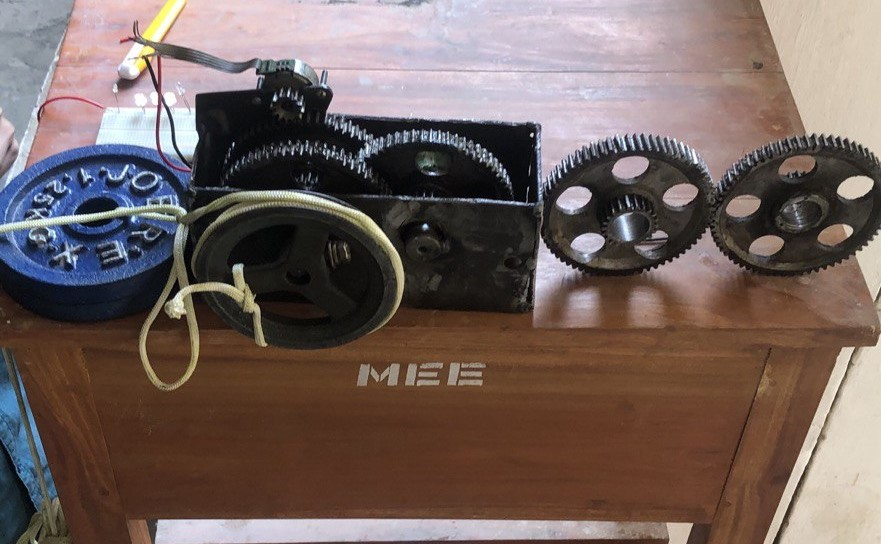
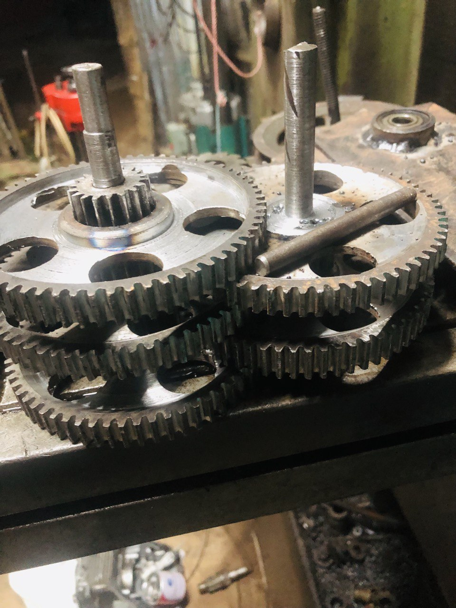
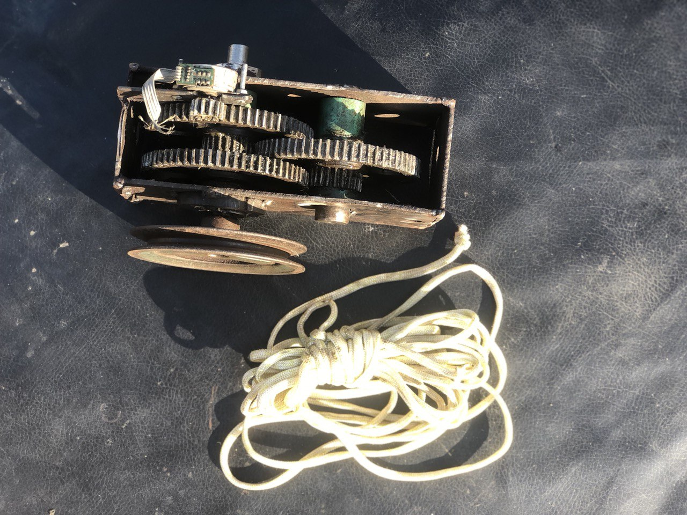

The Gravity Light project demonstrates the design, analysis, manufacturing, and assembly of a sustainable light powered by gravitational energy.

## Overview

The **Gravity Light** project utilizes various components to convert gravitational energy into electrical power:

- **Weight**: A solid metal weight serves as the primary energy source, generating gravitational force to drive the system's operation.
- **Rope**: A high-strength synthetic rope connects the weight to the motor, facilitating energy transfer as the weight descends.
- **Gearbox**: Houses the gears and pinion, optimizing power transmission while minimizing friction and wear.
- **Gears and Pinion**: Precision-engineered components ensure efficient power transmission from the motor, with optimized gear ratios for enhanced performance.
- **Motor**: A DC motor converts mechanical energy generated by the descending weight into electrical energy, powering the system reliably.
- **Light Bulb**: An LED bulb is used for low power consumption and durability, providing efficient lighting in areas with limited electricity.
- **Tachometer**: Measures the rotational speed of the motor and gears for performance assessment and system optimization.
- **Multimeter**: Monitors electrical output to ensure voltage levels meet the requirements for effective lighting.

---

## Design and Analysis

### Gear Ratio and Power Calculations

We began by analyzing various gear ratios to maximize torque and efficiency in converting gravitational energy into electrical power. The power calculations were essential to determine the required energy for lighting.

**Power Calculation**:

---

## Manufacturing Process

### Gear and Pinion Fabrication

Using conventional machining techniques, we manufactured high-precision gears and pinions. Material selection was critical for ensuring strength and durability in the system. We used steel for the gears due to its high load capacity and wear resistance.

**Gear Manufacturing Process**:

The gears and pinions were produced using a combination of lathes, milling machines, shapers, grinders, and drilling machines. Welding was utilized where necessary to join components, ensuring a strong and durable assembly.

**Gear Manufacturing Process Image**:

---

## Assembly and Integration

### Gearbox Assembly

The gearbox assembly was completed with precise alignment and lubrication to minimize friction and optimize energy transfer. Proper lubrication and adjustment of gear mesh ensured smooth operation of the system.

---

### Motor and Electrical Integration

A motor was integrated to convert mechanical energy into electrical energy, which powers the light bulb. Electrical wiring was carefully installed to ensure proper voltage regulation.

**Motor Installation**:

**Light Bulb Installation**:

---

## Testing and Instrumentation

### Gearbox Testing

To ensure the gearbox operated within the desired efficiency, we used a tachometer to measure gear RPM, ensuring accurate performance based on our design specifications.

**Testing Gearbox Performance**:

---

### Electrical Output Monitoring

We measured electrical output using a voltmeter to monitor the voltage generated by the system. The voltage output was found to be sufficient for the intended application of lighting.

**Electrical Output Measurement**:

---

## Conclusion

The Gravity Light project successfully demonstrated an efficient way to convert gravitational energy into electrical power using a mechanical system. The integration of gears, a motor, and electrical components resulted in a reliable lighting solution for areas with limited electricity access. This project highlights the potential for sustainable, gravity-based energy systems to meet basic needs in off-grid environments.

**Final Gravity Light System**:

